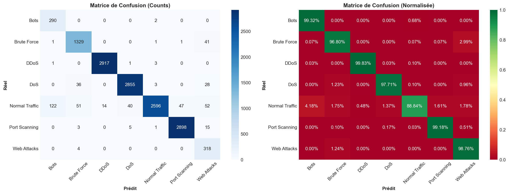
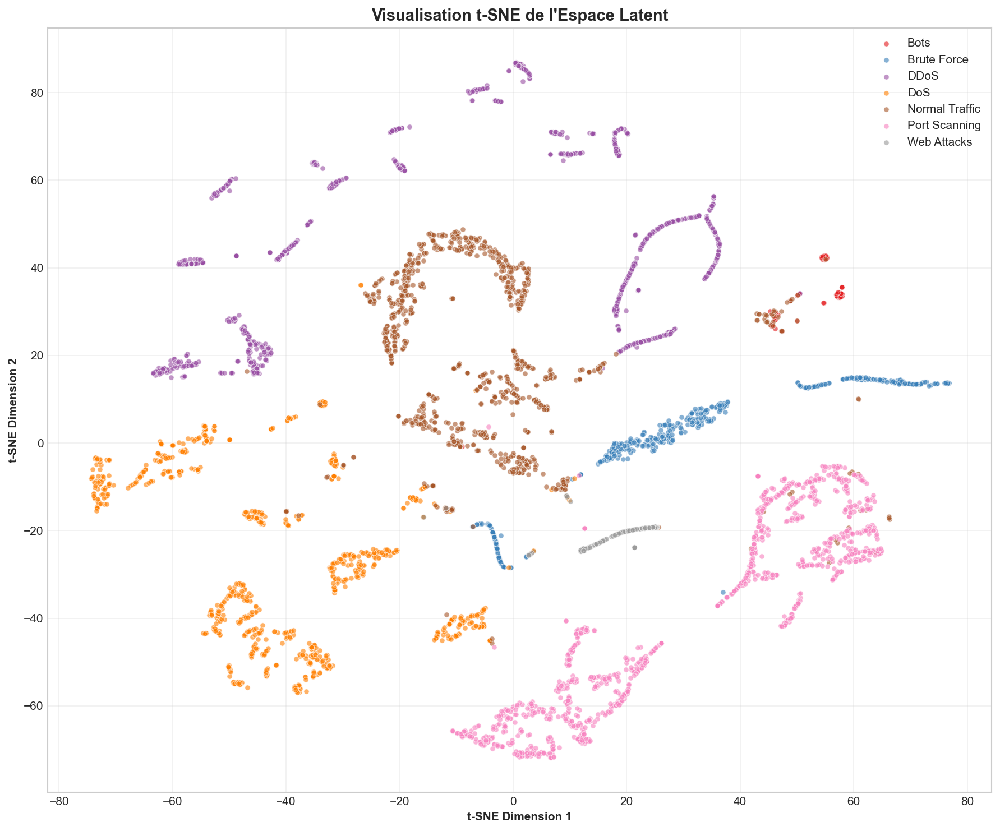

# IDS-Autoencoder-Classifier-DL-CICIDS

[](https://www.python.org/)
[](https://pytorch.org/)
[](LICENSE)

## Description

Système de Détection d'Intrusions (IDS) basé sur le **Deep Learning** utilisant une architecture hybride **Autoencoder + Classifier** pour la détection en temps réel d'attaques réseau.

Ce projet implémente une approche combinant:
- **Détection supervisée** : Classification des attaques connues
- **Détection d'anomalies** : Identification des comportements inhabituels via l'erreur de reconstruction

## Architecture du Modèle

```
┌─────────────────────────────────────────────────────────────────┐
│                    AUTOENCODER IDS                              │
├─────────────────────────────────────────────────────────────────┤
│                                                                 │
│  INPUT (52 features) ──► ENCODER ──► LATENT (16 dims)          │
│                              │              │                   │
│                              │              ├──► DECODER ──► RECONSTRUCTION
│                              │              │                   │
│                              │              └──► CLASSIFIER ──► 7 CLASSES
│                              │                                  │
│                              └──► Reconstruction Error ─────────┘
│                                                                 │
└─────────────────────────────────────────────────────────────────┘
```

## Dataset

**CICIDS2017** - Canadian Institute for Cybersecurity Intrusion Detection Dataset
- **2,520,751** flux réseau
- **52** features extraites
- **7** classes (Normal + 6 types d'attaques)

### Classes de Trafic:
| Classe | Description |
|--------|-------------|
| Normal | Trafic légitime |
| DDoS | Distributed Denial of Service |
| DoS | Denial of Service |
| Bots | Machines infectées (botnets) |
| PortScan | Reconnaissance par scan de ports |
| WebAttack | Attaques web (SQL Injection, XSS, Brute Force) |
| Infiltration | Intrusion dans le réseau |

## Installation

```bash
# Cloner le repository
git clone https://github.com/FaissalMarzouki/IDS-Autoencoder-classifier-DL-cicids.git
cd IDS-Autoencoder-classifier-DL-cicids

# Créer un environnement virtuel
python -m venv venv
source venv/bin/activate  # Linux/Mac
# ou
venv\Scripts\activate  # Windows

# Installer les dépendances
pip install -r requirements.txt
```

## Dépendances

```
torch>=2.0.0
pandas>=2.0.0
numpy>=1.24.0
scikit-learn>=1.3.0
matplotlib>=3.7.0
seaborn>=0.12.0
imbalanced-learn>=0.11.0
joblib>=1.3.0
tqdm>=4.65.0
```

## Structure du Projet

```
IDS-Autoencoder-classifier-DL-cicids/
│
├── IDS_DL_NOTEBOOK_COMPLETE.ipynb    # Notebook principal (entraînement complet)
├── CICIDS2017_Quick_Analysis.ipynb   # Analyse exploratoire rapide
│
├── dataset/
│   └── cicids2017_cleaned.csv        # Dataset nettoyé
│
├── models/
│   ├── autoencoder_ids_v1.1.0.pt     # Modèle PyTorch entraîné
│   ├── model_config.json             # Configuration du modèle
│   ├── scaler.joblib                 # Scaler pour normalisation
│   ├── label_encoder.joblib          # Encodeur des labels
│   ├── feature_names.json            # Noms des features
│   └── percentiles.joblib            # Percentiles pour clipping
│
├── results/
│   ├── training_curves.png           # Courbes d'entraînement
│   ├── confusion_matrix.png          # Matrice de confusion
│   ├── latent_space_tsne.png         # Visualisation t-SNE
│   └── reconstruction_error_analysis.png
│
├── requirements.txt
├── README.md
├── LICENSE
└── .gitignore
```

## Résultats

| Métrique | Score |
|----------|-------|
| **Accuracy** | ~95% |
| **F1-Score (Weighted)** | ~94% |
| **F1-Score (Macro)** | ~90% |
| **ROC-AUC** | ~98% |

### Visualisations

<p align="center">
  
  
</p>

## Utilisation

### Entraînement
Exécuter le notebook `IDS_DL_NOTEBOOK_COMPLETE.ipynb` cellule par cellule.

### Inférence (Prédiction)
```python
import torch
import json
import joblib

# Charger le modèle
model = AutoencoderIDS(config)
model.load_state_dict(torch.load('models/autoencoder_ids_v1.1.0.pt'))
model.eval()

# Charger les préprocesseurs
scaler = joblib.load('models/scaler.joblib')
label_encoder = joblib.load('models/label_encoder.joblib')

# Prédire
with torch.no_grad():
    features_scaled = scaler.transform(features)
    prediction = model.predict(torch.tensor(features_scaled, dtype=torch.float32))
```

### Format de Sortie JSON (pour intégration LLM)
```json
{
  "flow_id": "flow_001",
  "timestamp": "2024-01-15T10:30:00Z",
  "prediction": {
    "class": "DDoS",
    "confidence": 0.95,
    "anomaly_score": 0.82
  },
  "features_summary": {
    "bytes_sent": 150000,
    "packets": 1200,
    "duration": 2.5
  }
}
```

## Techniques Utilisées

- **Focal Loss** : Gestion du déséquilibre des classes (ratio 1075:1)
- **Batch Normalization** : Stabilisation de l'entraînement
- **Dropout** : Régularisation (0.3)
- **Early Stopping** : Prévention du surapprentissage
- **Under-sampling stratifié** : Équilibrage du dataset
- **StandardScaler avec clipping** : Normalisation robuste aux outliers

## Références

- [CICIDS2017 Dataset](https://www.unb.ca/cic/datasets/ids-2017.html)
- [Autoencoder for Anomaly Detection](https://arxiv.org/abs/1906.02994)
- [Focal Loss for Dense Object Detection](https://arxiv.org/abs/1708.02002)

## Auteur

**Faissal Marzouki**

## License

Ce projet est sous licence MIT - voir le fichier [LICENSE](LICENSE) pour plus de détails.

---

N'hésitez pas à mettre une étoile si ce projet vous a été utile!
